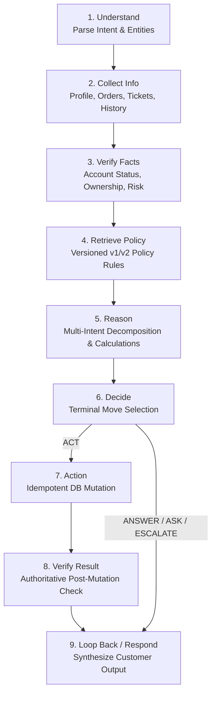

# MANTRAYUDHA AI Customer Support Agent — Agent Strategy & Architecture

## Executive Overview
NovaMart AI Customer Support Agent is an enterprise-grade autonomous support agent engineered strictly under the **MANTRAYUDHA Participant Handbook** specifications. 

The architecture follows the core principle:
> **"AI reasons. Backend verifies. Database stores truth. Tools perform actions. Humans handle exceptions."**

---

## 1. The 9-Step Agent Core Loop (Loop Engineering)
Every customer interaction executes through an explicit, auditable 9-step Core Loop orchestrated by a deterministic LangGraph state machine:

### Step Breakdown:
1. **01_Understand**: Extracts customer IDs, order IDs, SKUs, and deconstructs compound user intents (cancellations, returns, refunds, tracking, specs, reviews, address changes).
2. **02_Collect Info**: Grounded retrieval from authoritative database layers — customer profile, order history, support tickets, and past conversations (Page 14 Context Continuity).
3. **03_Verify Facts**: Independent security and risk assessment:
   - Account status (suspension detection)
   - Cross-account ownership gating
   - Adversarial prompt injection defense
   - Safety hazard and legal threat detection
4. **04_Retrieve Policy**: Temporal policy resolution:
   - **Policy v1** (orders placed prior to June 1, 2026): 10-day return window, ₹100,000 human approval threshold, zero restocking fee.
   - **Policy v2** (orders placed on/after June 1, 2026): 7-day return window, ₹75,000 threshold, 5% restocking fee on high-risk categories.
   - **Loyalty extensions**: Gold (+2 days), Platinum (+3 days).
5. **05_Reason**: Synthesizes verified facts against policy logic:
   - Computes deterministic price breakdown: $\text{Refund} = \text{Item Price} + 18\%\text{ GST} - \text{Restocking Fee}$.
   - Deconstructs multi-part queries (e.g. delivery dispute + refund hold + address change).
   - Enforces Page 11 refund capping ($\min(\text{requested}, \text{allowable})$).
6. **06_Decide**: Selects one of four immutable terminal moves: `ANSWER`, `ASK`, `ACT`, or `ESCALATE`.
7. **07_Action**: For `ACT`, invokes verified mutation tools with unique idempotency keys (`cancel_order`, `create_refund`, `create_return`).
8. **08_Verify Result**: Re-queries the authoritative database to verify state transitions (e.g. `order_status == 'cancelled'`).
9. **09_Loop Back / Respond**: Returns transparent, accurate, and empathetic messages explaining decisions and next steps.

---

## 2. The 4 Terminal Moves
The agent terminates every invocation in exactly one of four verified actions:

| Terminal Move | Trigger Conditions | Example Output Behavior |
| :--- | :--- | :--- |
| **ANSWER** | Policy inquiries, tracking status, specifications, reviews, declined requests with reason, or capped refund explanations. | Provides exact factual breakdown with policy references; never mutates DB. |
| **ASK** | Ambiguous requests (e.g. customer has multiple active orders) or non-existent order numbers. | Asks clarifying question without guessing; lists candidate orders. |
| **ACT** | Customer requests eligible cancellation, return, or refund on an authorized order within policy window. | Executes idempotent mutation, verifies DB state, provides reference ID. |
| **ESCALATE** | Safety hazard, legal threat, suspended account, cross-account access, OTP-confirmed non-receipt, high-value threshold. | Creates support ticket in database, routes to specialized human team, provides ticket ID. |

---

## 3. Seven Authoritative Data Layers
The agent queries seven distinct data layers in `support_agent.db`:
1. **Customers**: 1,500 profiles with loyalty tiers (`Bronze`, `Silver`, `Gold`, `Platinum`) and account statuses.
2. **Orders**: 8,000 orders across lifecycle states (`placed`, `confirmed`, `processing`, `shipped`, `out_for_delivery`, `delivered`, `cancelled`, `returned`).
3. **Order Items**: Individual line items with unit prices, discounts, and item return statuses.
4. **Products**: 300 products across electronics, fashion, home, and beauty.
5. **Product Specifications**: 300 Markdown specification sheets mapped under `public/products/*.md`.
6. **Customer Reviews**: 3,000 verified product reviews with star ratings and comments.
7. **Tickets & Conversations**: 2,578 support tickets and 1,500 customer chat sessions loaded at session start for context continuity.

---

## 4. Multi-Intent Decomposition Strategy
The agent deconstructs compound requests into atomic intents and evaluates each with tailored policy rules:

### A. Cancellation + Tracking
- Checks pre-dispatch eligibility. If eligible: cancels order, issues full refund (if prepaid), and provides current stage/courier info. If already shipped: explains why cancellation is declined and provides live tracking details.

### B. Return Request + Refund Amount Calculation
- Evaluates category returnability and window. Calculates exact refund ($Price + 18\% GST - Restocking$). Replies with calculation breakdown.

### C. 3-Way Compound: Delivery Dispute + Refund Request + Address Update (Page 16)
- **Delivery Dispute**: Checks OTP. If OTP-verified, flags contradiction and escalates to Logistics Desk.
- **Refund Claim**: Held pending completion of delivery investigation.
- **Address Update**: Prohibits address modification on shipped/delivered orders; directs customer to account settings for future orders.

### D. Excess Refund Capping (Page 11)
- If requested amount exceeds order value (e.g. ₹50,000 requested for ₹2,499 order), agent does **not** escalate.
- Deterministically caps refund to $\min(\text{requested}, \text{max\_allowable})$.
- Transparently explains policy cap and offers to proceed with the valid amount.

---

## 5. Security & Safety Gates
- **Prompt Injection Defense**: Pre-flight regex filtering against instruction override, admin impersonation, or policy bypass.
- **Hazard Routing**: Smoke, swelling batteries, or electrical hazards route directly to `Technical Support` with `CRITICAL` priority.
- **Legal Threats**: Consumer court or attorney threats route directly to `Customer Experience` with `HIGH` priority.
- **Cross-Account Protection**: Strict customer ownership verification before exposing order details or executing actions.
